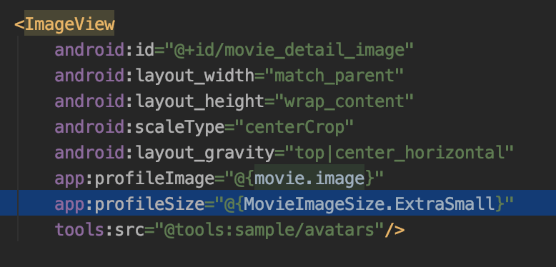

# Movies-android-demo

## Architecture stack
This project was implemented using the recommended Google's architecture libraries stack.

What you will find here:
- A single-activity architecture, using the Navigation component to manage fragment operations.
- Kotlin Coroutines for background operations.
- A presentation layer that contains a fragment (View) and a ViewModel per screen (or feature).
- Reactive UIs using LiveData observables and Data Binding.
- A data layer with a repository and one data source (using Retrofit)
- Custom implementation and use of Retrofit adapters and interceptors
- Dagger 2 for DI under the **di** folder

## Obtaining the token form the API
For this feature development, I decided to use a Retrofit interceptor. The _ApikeyInterceptor_ class stores the value of the **KEY** header. This key is updated every time the _key_ endpoint is fetched.
Then the key is automatically added to the headers of any further request.

## Movies Lists
For the list of movies screen, I made use of the Pagging Google's library that simplifies a lot the task of loading data chunks. Thanks to the MVVM pattern used in this project together with other useful libraries like viewModel, data-binding, lifecycle, coroutines, etc. It wasn't too difficult integrating all the components to create a stable app, safe to configuration changes, and with a reactive behavior under the hood.

### Search movies with suggestions
Use the search bar and search anything, you could combine this with the sort option (although it's not supported by the API). The search bar will show a suggestion list of the movies that are being loaded in the current session so far, you can choose a title from the suggestion list to get into the movies detail in one step.

### Content filtering
Adult content is filtered by the repository. However, this feature absolutely depends on the data fetched from the repository (there are a huge of movies that should be reviewed to be marked out, just to know it)

## Movie Details
For this view, I decided to experiment a little more with user interaction and motion. MotionLayout along with ConstraintLayout give us the ability to create a dynamic UI that reacts to the user interactions.

## Login view
The most simple view to demonstrate a simple and basic configuration of the MVVM pattern used in the project.

## Errors handling
The __Result__ class is a global class used to represent the state of the resources. This helps us, for example, to manage the view state while waiting for a response from the remote data source to login. Additionally, a retrofit call adapter is used to map any error response trowed from the service, avoiding unwanted runtime exceptions and giving us the ability to show the error messages to the user and some option for safety recovering.

## Navigation components
Navigation components with Arguments library are used to manage the application back stack. So simple and powerful to use, as should be.

## Data mappers
The idea of using a mapper is to separate the models in each layer. Although this project is not big enough to justify a large use of this pattern I included a simple example of the right way of using them. The MovieResponse and Movie class represents the same kind of state for two different layers. This gives us the ability to add, remove, and modify the remote-source model specification independently from the domain one. This is an architecture design key when implementing big and robust products.

## Unit tests:
I added a couple of unit tests for the view models. I apologize if there are so few but creating the tests from scratch takes more time than implementing the product code. However, these couple of tests makes a suitable base to implements the rest of them.

## Other tools and libs used during development
- I added Stetho lib for debugging the app. 
- Charles was really helpful when implementing the first step for setting up the API key and getting the endpoint working
- This project uses Glide for loading the movie's images, with a custom global setup. Additionally, there is a little hook that helps me to choose the image size to be loaded directly from the XML. In this way, I can use different image sizes from different layouts in a single line of XML code.

